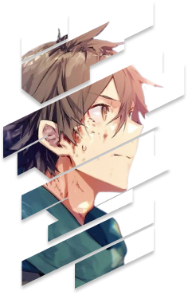
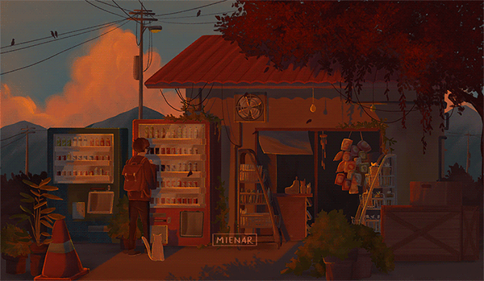

 

  

 
 
 
 

<h3 align="center">  Welcome to my Github Profile</h3>

    
    
    
    
    
    
    
    
    
    
    
    
    
    
    
    
    
    
    
    
    
    
    

  
  

  &nbsp;&#10022; 👨‍🎓I'm currently  pursuing Bachelor of technology (CSE) @ AKU 🏫 

  &nbsp;&#10022; 💁Learning has no limits , 🙋 so I always try to learn new thing

  &nbsp;&#10022; 🙇I'm currently learning  Data structures and algorithms , web development and open-source 

  &nbsp;&#10022; 🙆I'm looking to collaborate on web-development projects 
  

<b>*About Me*:</b>

 

 
 I am currently enrolled in the Bachelor of Technology program in Computer Science and Engineering at Assam Kaziranga University. My passion lies in coding, gaming, and continually enhancing my skill set in programming.I'm currently in my fourth semester, I am focused on  development and also  actively engage in problem-solving .

<b>*Connect with Me*:</b>

   &nbsp; 
   
   
   
   
   
   
  

  <b>*Tech Stack*:</b>

   &nbsp; 
   
   
   
   
    
    
  

  <b> *Profile Stats*: </b>

 

  
  

 

 

  
 

   

  
  
  

    
   

